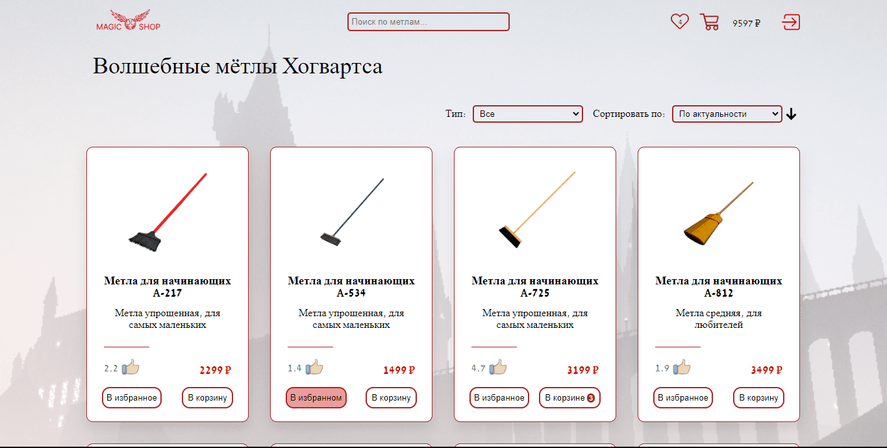
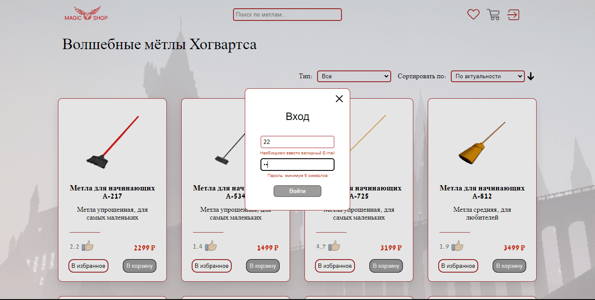
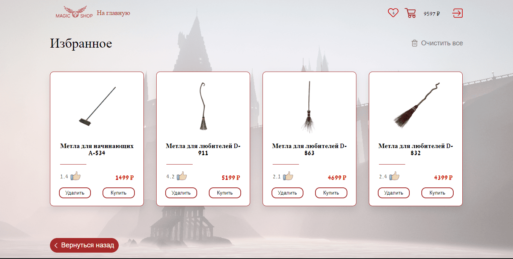
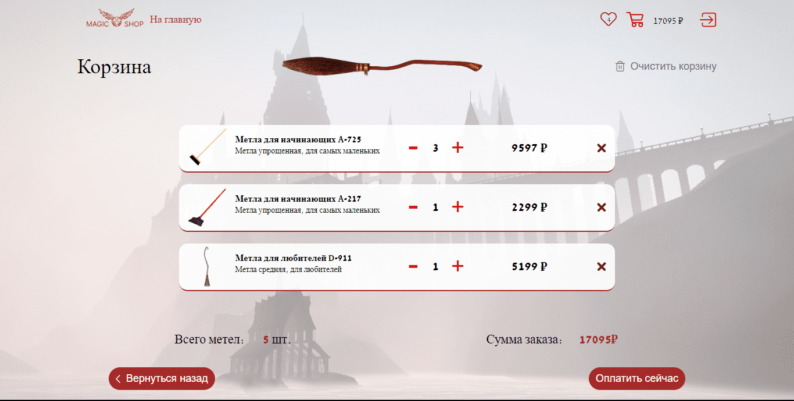

<p align="center">


</p>

<h1 align="center">Broom Shop</h1>


<h2 align="center"><a target="_blank"  href="https://broom-shop-v2.vercel.app/">Live Demo</a></h2>

<br />

<p align="center">
   


</p>

## Description

Broom shop - shop for buying magic brooms!

## Authentication

<p align="center">
   


</p>

The user is verified using the Firebase service. Form validation is handled by React-hook-form

## Favorites page

<p align="center">
   


</p>

When adding an item to favorites, the number of items is added to the "favorites" icon. From this page, you can add products to the cart, but no more than once, and when you delete an item from the cart, the "add to cart" button on the Favorites page changes to "add to cart"

## Cart

<p align="center">
   


</p>

The total amount of the entire product is summed up in the shopping cart. If the quantity of the product is less than zero, then the amount of the product will be zero. You can also empty the trash with one button

## About the project

#### Frontend stack: 

- React
- SCSS
- Redux-toolkit
- TypeScript

#### Backend stack: 

 JSON comes from the mockApi server

## Project setup

```
npm install
npm run start
```
